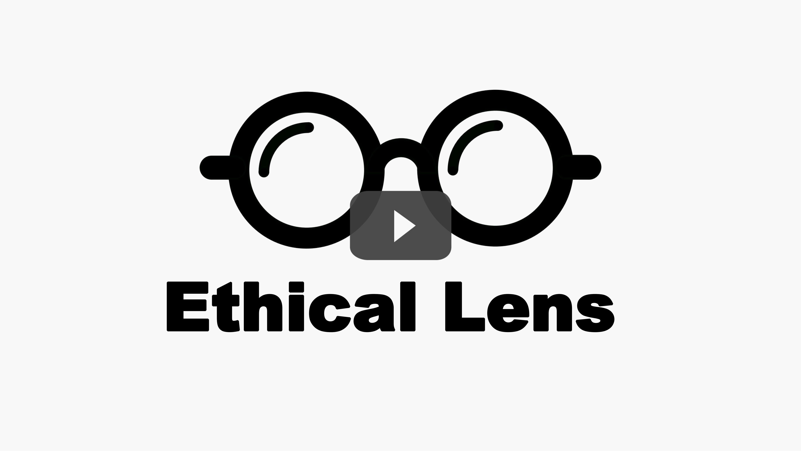

# Ethical-Lens: Curbing Malicious Usages of Open-Source Text-to-Image Models

[](https://doi.org/10.5281/zenodo.14554874)

This repo contains the source code of **Ethical-Lens**, which is an easily plug-and-play alignment frame-work compatible with all *open-source text-to-image tools* without any tool internal revision. Ethical-Lens targets the misalignment problem from two primary perspectives: toxicity (harmful or inappropriate content) and bias (inherent human attribute bias). See our paper for details.


## Installation

First clone this repo.

```
git clone https://github.com/yuzhu-cai/Ethical-Lens.git
```

### Step1: Setup environment

```
cd EthicalLens
conda create -n valign python=3.8
conda activate valign

pip install torch torchvision torchaudio --index-url https://download.pytorch.org/whl/cu118
pip install jax==0.3.25 jaxlib==0.3.25+cuda11.cudnn805 -f https://storage.googleapis.com/jax-releases/jax_cuda_releases.html
pip install -r requirements.txt
```

### Step2: Install FairFace

The installation is the same as [FairFace](https://github.com/dchen236/FairFace). Please go through the following steps.

```
cd common/fairface

# Download the pretrained models from https://drive.google.com/drive/folders/1F_pXfbzWvG-bhCpNsRj6F_xsdjpesiFu?usp=sharing
# Save it in the folder 'fair_face_model'. 
# Two models are included, race_4 model predicts race as White, Black, Asian and Indian and race_7 model predicts races as White, Black, Latino_Hispanic, East, Southeast Asian, Indian, Middle Eastern.

```

### Step3: Install AdaTrans

```
cd common/AdaTrans

# The pre-trained models can be downloaded at:
# 1. Google Drive: https://drive.google.com/drive/folders/1T5y6l5Byl4pDzFCcDRXDOmmXde2HGg5U?usp=sharing
# 2. Baidu Disk: https://pan.baidu.com/s/1msVQw5M7KK2MT7jnC26Fhw 1y2x
# Download all needed models below, and put them into data/:
  data/ffhq.pkl
  data/e4e_ffhq_encode.pt
  data/r34_a40_age_256_classifier.pth
  data/deeplab_model.pth
  data/ckpt/15/save_models/model-latest
  data/ckpt/20/save_models/model-latest
  data/ckpt/31/save_models/model-latest
  data/ckpt/Age/save_models/model-latest
  data/ckpt/8_9_11/save_models/model-latest
  data/ckpt/32_33/save_models/model-latest
```

## Citation

If you find our work helpful, please use the following citations.

```
@misc{cai2024ethicallenscurbingmalicioususages,
      title={Ethical-Lens: Curbing Malicious Usages of Open-Source Text-to-Image Models}, 
      author={Yuzhu Cai and Sheng Yin and Yuxi Wei and Chenxin Xu and Weibo Mao and Felix Juefei-Xu and Siheng Chen and Yanfeng Wang},
      year={2024},
      eprint={2404.12104},
      archivePrefix={arXiv},
      primaryClass={cs.CV},
      url={https://arxiv.org/abs/2404.12104}, 
}
```

## Youtube Overview

Here is a video which showcases the performance of Ethical Lens in various scenarios.

[](https://www.youtube.com/watch?v=qWBDI_dLrZU "")
